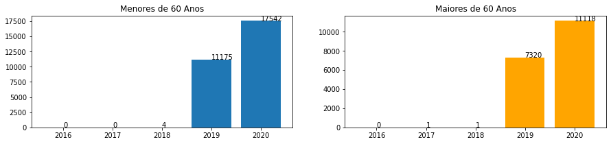

# Projeto Impacto da pandemia de Covid-19 sobre o tratamento do câncer de mama no SUS

# Project Impact of the Covid-19 pandemic on the treatment of breast cancer in SUS

# Apresentação

O presente projeto foi originado no contexto das atividades da disciplina de pós-graduação [*Ciência e Visualização de Dados em Saúde*](https://github.com/datasci4health/home), oferecida no primeiro semestre de 2021, na Unicamp.

| Nome   | RA    | Especialização |
| ------ | ----- | -------------- |
| Annemeri Livinalli | 226976 | Saúde |
| Kevin Martins Araújo | 223971 | Computação |
| Luísa von Zuben Veçoso | 156457 | Saúde |
| Rafael Duarte Paes | 224242 | Saúde |

# Descrição Resumida do Projeto
A COVID-19, doença causada pelo vírus SARS-CoV-2, emergiu na China no final de 2019. Com o número crescente de casos avançando globalmente, em março de 2020 a Organização Mundial de Saúde reconheceu a pandemia [1] e instituiu medidas preventivas contra a disseminação, incluindo distanciamento associado à medidas de higiene [2]. A doença, transmitida por via respiratória [3],  causou até abril de 2021, mais de 2,9 milhões de óbitos em todo o mundo [4] e mais de 340 mil no Brasil [5]. 
Dentre os diversos impactos da pandemia observados globalmente, o medo da COVID-19 resultou em uma redução na demanda por atendimento médico em situações consideradas não urgentes, incluindo exames diagnósticos de câncer e o próprio tratamento, incluindo quimioterapia, radioterapia ou cirurgia [6]. No Brasil, os diagnósticos de câncer reduziram de 24,3% (região Norte) a 42,7% (região Nordeste), com média de 35,5% no país, correspondentes a 15 mil casos não diagnosticados por mês no período de janeiro a agosto de 2020 [7]. O tratamento dos pacientes com câncer também reduziu em alguns países, tornando-se uma preocupação desde o início da pandemia [6]. 

Neste contexto, buscamos por dados que apontassem  o impacto da pandemia no tratamento de mulheres com idade igual ou superior a 60 anos com câncer de mama no Brasil. Fizemos a comparação do número de procedimentos relacionados aos tratamentos (quimioterapia e radioterapia) realizados durante a pandemia em 2020 com a quantidade realizada no mesmo período em anos anteriores.

Link para vídeo de apresentação da proposta do projeto: https://drive.google.com/file/d/1w6-9AbcpNAfgPTRWBStaWuJMb-mndVEQ/view?usp=sharing 

# Pergunta de Pesquisa
Qual o impacto da pandemia de Covid-19 no tratamento do câncer de mama não metastático, em mulheres acima dos 60 anos, atendidas no Sistema Único de Saúde (SUS).

# Metodologia

Com base nas informações de acesso público disponibilizadas pelo Departamento de Informática do Sistema Único de Saúde (DATASUS), analisamos os dados mensais de produção ambulatorial relacionados aos procedimentos de tratamento do câncer de mama, por região de atendimento, no período de Janeiro de 2016 a Dezembro de 2020. Buscamos estes dados no sistema TabNet, que é um programa do DATASUS em que os dados são tabulados e disponibilizados em ambiente internet, com auxílio da ferramenta TabWin, que permite o cruzamento destes dados. Incluímos os dados de mulheres com idade ≥ 60 anos, com diagnóstico de câncer de mama não metastático, atendidas no Sistema Único de Saúde (SUS).
Com base nas diretrizes diagnósticas e terapêuticas do carcinoma de mama, consultamos os códigos dos procedimentos no sistema de gerenciamento da tabela de procedimentos, medicamentos e OPM do SUS (SIGTAP). Obtivemos os dados dos seguintes procedimentos:
* monoquimioterapia ou poliquimioterapia
* hormonioterapia
* radioterapia de mama

O número de casos acumulados de Covid-19 por região foi obtido na plataforma [*CoronavírusBrasil*](https://covid.saude.gov.br/).

Em relação ao câncer, consideramos as seguintes variáveis categóricas: localização geográfica (região de tratamento), tipo de tratamento; e numéricas: idade. Em relação à Covid-19 consideramos as mesmas variáveis, exceto o tipo de tratamento.

A frequência de cada conjunto de procedimentos (quimioterapia e radioterapia) está descrita como média, por ano e região. Considerando que as variáveis assumirão uma distribuição normal, afim de comparar as proporções e distribuições dos procedimentos entre cada ano, aplicamos o teste de hipótese qui-quadrado com as seguintes hipóteses:
H0: 2016 = 2017 = 2018 = 2019 = 2020
H1: 2016 ≠ 2017 ≠ 2018 ≠ 2019 ≠ 2020

Adotamos P < 0.05.

Os dados foram organizados e apresentados em tabelas de frequências e gráficos.

O estudo foi conduzido com base no modelo de processo *Knowledge Discovery in Databases* (KDD) e suas respectivas etapas descritas por Fayyad e col [8]. Fizemos a seleção das bases de dados para uso, pré-processamos, e tratamos, com o objetivo de entender os dados obtidos, remover dados errados, nulos, irrelevantes ou considerados como outliers. Para a manipulação, cruzamento e análise das bases de dados utilizamos a linguagem de programação Python, e em alguns momentos utilizamos o programa Jupyter Notebook para auxiliar no desenvolvimento dos códigos. Também será utilizada a ferramenta Orange3 Data Mining e WEKA, que são ferramentas que auxiliam na análise e mineração dos dados.

## Bases de Dados e Evolução
### Bases Estudadas mas Não Adotadas
| Base de Dados | Localização | Descrição |
|--|--|--|
| Observatório de oncologia | [*Observatório de Oncologia*](http://observatoriodeoncologia.com.br/tratamento-do-cancer-de-mama-no-sus/) | plataforma online de monitoramento de dados abertos |
| SIH/SUS | [*DATASUS/SIHSUS*](http://www2.datasus.gov.br/DATASUS/index.php?area=0202&id=11633) | Arquivos com informações de cirurgias. |

Esta base foi consultada para verificação dos dados de número de casos de câncer de mama. Não se trata de uma base geradora de banco, por essa razão não a utilizamos.

### Bases Estudadas e Adotadas
Utilizamos as bases de dados fornecido pelo DATASUS, o integrador de Registros Hospitalares de Câncer (RHC) desenvolvido pelo INCA, e uma base de dados do Coronavírus Brasil que possui os dados sobre a Covid-19.

| Base de Dados | Localização | Descrição |
|--|--|--|
| SIASUS | [*DATASUS/SIASUS*](http://www2.datasus.gov.br/DATASUS/index.php?area=0901&item=1&acao=22&pad=31655) | Arquivos com informações referente aos atendimentos ambulatoriais. |
|COVID-19 | [*CoronavírusBrasil*](https://covid.saude.gov.br/) | Site com painel interativo com dados da Covid-19 informados pelo Ministério da Saúde|
|Integrador RHC|[*Integrador RHC*](https://irhc.inca.gov.br/RHCNet/)|sistema desenvolvido pelo INCA para consolidação de dados hospitalares provenientes dos Registros Hospitalares de Câncer de todo o Brasil.|

### Integração entre Bases e Análise Exploratória

**Datasus:**

**BANCO DE DADOS: APAC**

As informações contidas nos arquivos de procedimentos ambulatoriais referem-se aos atendimentos ambulatoriais realizados nas respectivas competências (ano e mês). Dentro do arquivo dbf constam dados dos procedimentos ambulatoriais obtidos através do instrumento de registro do SIASUS denominado Autorização de Procedimentos Ambulatoriais de Alta Complexidade (APAC).

Um instrumento APAC gera diversos registros no arquivo, sendo um para cada código de procedimento na APAC, seja ele procedimento principal ou secundário. Neste estudo utilizamos apenas o procedimento principal. Tais procedimentos foram consultados no SIGTAP e no Manual de Bases Técnicas em Oncologia, versão 2019 e selecionados conforme o critério de elegibilidade (doença não metastática).

Os arquivos de APAC são compostos conforme o tipo de laudo (tipo de atendimento) da APAC. Para nossas análises utilizamos apenas laudos de medicamentos, de quimioterapia e de radioterapia. 

***APAC - quimioterapia***

A base de dados da APAC de Quimioterapia possui 63 variáveis, que são definidas e explicadas pela documentação oficial do DATASUS referente ao SIASUS (Informe Técnico 2016-03). Para análise, elencamos 7 variáveis do banco: idade, se a APAC era inicial ou continuidade, CID principal, estadiamento da doença, esquema do tratamento, estado, e data de solicitação. Estas variáveis auxiliaram na certeza de que estávamos com dados da população que elegemos para o estudo.
 
Com as variáveis definidas, iniciamos o processo de extração, tratamento e carga dos dados. Os arquivos fornecidos pelo DATASUS possuem um arquivo de extensão ‘dbc’. Esse tipo de extensão é lido pelo programa Tabwin que é fornecido pelo próprio DATASUS. Utilizando o Tabwin realizamos as leituras dos arquivos dbc dos anos de  2016 a 2020, e realizamos a expansão dos dados para um arquivo no formato ‘dbf’. A partir dos arquivos ‘dbf’ realizamos a extração e conversão dos dados contidos, utilizando código em Python. Como o foco do trabalho é analisar o câncer em pessoas do sexo feminino, no momento da extração dos dados para um arquivo excel foi realizado um filtro onde apenas os registros relacionados ao sexo feminino foram extraídos.

Neste primeiro processo de ETL, foi obtido um arquivo em excel com aproximadamente 17 milhões de regitros (17.026.164) do sexo masculino e feminino, ao selecionar apenas os dados do sexo feminino e restringir os procedimentos que são aplicados ao nosso problema (AP_PRIPAL), obtivemos uma base de dados com quase 11 milhões de registros (10.904.294 registros).

A variável AP_PRIPAL é referente ao código do procedimento principal realizada na APAC. Com base no SIGTAP e do Manual de Oncologia, versão 2019, elencamos os códigos de procedimentos indicados para mulheres com doença não metastática. Optamos por analisar somente dados de pacientes com doença não metastática porque, a princípio, são pacientes com maior chance de cura, e no caso de encontrarmos redução no número de procedimentos, saberíamos que a pandemia estaria impactando em pessoas com bom prognóstico. Com o objetivo de facilitar a análise dos procedimentos que são considerados como metastático ou não metastático, foi criada a variável METASTÁTICO, que varia entre 0 ou 1, onde 0 é um procedimento não metastático, e 1 é um procedimento metastático. 

Após o primeiro tratamento concluído iniciamos o segundo processo de tratamento dos dados. Antes de aplicarmos o filtro de idade nos dados e assim obter uma redução dos nossos dados, resolvemos aplicar algumas análises simples nessa primeira base de dados. O objetivo dessa análise foi verificar se os dados de mulheres ⩽ 60 anos e ⩾ 60 anos estavam balanceados. Mesmo que o foco do nosso trabalho fosse as mulheres ⩾ 60 anos, resolvemos analisar a base para garantir que os dados femininos não estariam desbalanceados nessa faixa etária.

Desta forma, conseguimos identificar que a base de dados possui cerca de 53,23 % dados referente a mulheres com idade menor que 60 anos, e aproximadamente 46,77 % de dados de mulheres com 60 anos ou mais. Fizemos mais algumas análises por outras faixas etárias, que é apresentada na tabela a seguir:

**Tabela 1 - Distribuição de registros por faixa etária**
|Faixa Etária (anos)|Quantidade|%|
|--|--|--|
|0 - 19|145618|1,3|
|20 - 39|761234|7,0|
|40 - 59|4897659|44,9|
|60 - 79|4457667|40,9|
|80 - 100|642120|5,9|

A partir dessa tabela podemos notar que a maioria dos registros estão na faixa etária 40 a 79 anos, informação que coincide com dados da literatura que apontam maior incidência na população idosa, a partir dos 60 anos, seguido pela faixa etária entre 40 e 59 anos.

Também análisamos os registros das pacientes com menos de 60 anos e acima dos 60 anos por estado. Porém, para que isso fosse possível foi necessário converter a variável AP_UFMUN para o valor da unidade da federação (UF). Essa variável possui 6 números, onde os dois primeiros são referentes ao código da unidade da federação. Os códigos de cada estado foram obtidos pela página do Instituto Brasileiro de Geografia e Estatística (IBGE). Com a conversão da variável AP_UFMUN para a UF, foi criada a variável “ESTADO_UF”, onde foi armazenada a UF de cada registro. Com esse tratamento, foi realizada a análise da distribuição dos dados abaixo e acima de 60 entre os estados, como pode ser visto na figura 1 .

Na figura 1 observamos que os dados possuem um certo balanço entre os dados das pessoas com menos de 60 anos e pessoas acima dos 60 anos. Com a conclusão dessa primeira análise simples, analisando apenas a distribuição dos dados em relação à faixa etária definida e a sua distribuição entre os estados, aplicamos o filtro de idade nos dados. Dos quase 11 milhões de registros, selecionamos apenas os registros que possuíam 60 anos ou mais. Isso resultou em uma base de dados com aproximadamente 5 milhões de registros (5.099.787).

Concluído o segundo processo de filtragem, iniciamos a análise dos registros da variável “AP_DTSOLIC”. A variável AP_DTSOLIC é a variável que apresenta a data da APAC. O objetivo é analisar os dados que estão entre os anos de 2016 e 2020, portanto todos os registros que possuem a data fora desse intervalo foram removidos. Também foram removidos os registros onde essa variável estava vazia, porque não era possível definir qual era o mês e ano daquele registro. Nesse processo foram removidos 250.180 registros.

Após a conclusão dessa terceira filtragem, aplicamos um tratamento no campo AP_DTSOLIC para que os valores apresentados fossem referenciados ao último dia de cada mês e ano, facilitando assim um agrupamento e análise futura. Desta forma seria possível realizar o agrupamento dos dados, e assim reduzir o número de registros, mas sem perder suas características referentes às outras variáveis. 

Com a conversão da features AP_DTSOLIC e aplicando um agrupamento de todos os registros, obtivemos um número de 1.790.600 registros agrupados. Uma redução considerável e que se fez necessário devido ao alto custo computacional que estava sendo gasto com a manipulação dos dados sem agrupamentos. Com o agrupamento foi criado a variável “QTD”, que informa a quantidade de registros que foram agrupados no novo registro. No agrupamento os dados missing existentes não foram removidos.

Nesse momento, a única variável que apresentou dados missing foi a variável “AQ_ESQU_P2”, que se refere ao esquema terapêutico. O número de dados missing nessa variável foi de aproximadamente 20 % de linhas e 24% de registros no geral, e nesse primeiro momento escolhemos não remover esses dados da nossa análise.
Após a aplicação dos procedimentos mencionados, iniciamos a análise mais detalhada dos dados.

Como descrito anteriormente, elencamos mulheres acima de 60 anos para as análises, visto que desde o início da pandemia a população idosa foi reconhecida como sendo a mais afetada e com maior taxa de mortalidade causada pela Covid-19.

Ao dividirmos a faixa etária acima de 60 anos em subgrupos etários, verificamos uma maior frequência de procedimento “quimioterapia” na faixa etária 60-70 anos (55,7%), seguido por 70-80 anos (31,7%) e 80-90 anos (11,1%). Acima de 90 anos a parcela de mulheres com câncer mostrou-se bastante reduzida, 1,5% (tabela 2).

**Tabela 2 - Distribuição de registros por subgrupo etário**

|Faixa Etária|Quantidade de Registros|% de Registros|
|--|--|--|
|60 - 69|2.016.472|55,7|
|70 - 79|1.146.504|31,7|
|80 - 89|401.474|11,1|
|90 - 100|54.190|1,5|

Os cinco estados com maior volume de procedimentos (Fig 2) estão na região Sul (Paraná com 259.160 registros e Rio Grande do Sul com 418.355 registros) e Sudeste (São Paulo com 977.937 registros, Minas Gerais com 441.108 registros e Rio de Janeiro com 298.919 registros).

Para verificar se a Covid-19 impactou na quantidade dos procedimentos que elencamos como de nosso interesse  e realizados em 2020, fizemos uma análise de distribuição por ano e observamos uma pequena variação dos dados em relação ao ano anterior, com exceção do ano de 2018 que mostrou uma variação de 18.4% em relação aos dois anos anteriores. Porém, em 2019 não houve variação expressiva, assim como também não observamos variação em 2020 (Tabela 3).

**Tabela 3 - Variação na frequência de procedimentos**
|Ano|Quantidade.|% de Variação|
|--|--|--|
|2016|656.882|0|
|2017|637.126|-3,007|
|2018|754.606|18,439|
|2019|790.968|4,819|
|2020|779.058|-1,506|

Ao analisar os dados de estadiamento (AQ_ESTADI), predominou o estadiamento II, que é considerado um estadiamento menos grave que o estadiamento IV. Como selecionamos códigos de procedimentos relacionados à doença não metastática, era esperado que não constasse em nosso banco de dados mulheres com estádio IV, porém há o registro de procedimentos para mulheres com estádio IV em nosso banco. 

Após estas análises preliminares, procedemos à análise por ano e por estado. Na visualização dos gráficos selecionamos algumas observações para aprofundar na análise exploratória:

a. O estado do Acre teve uma queda acima de 50% na quantidade de procedimentos em 2020;

b. Os estados do Alagoas, Amazonas, Bahia, Ceará, Distrito Federal, Espírito Santo, Goiás, Maranhão, Minas Gerais, Mato Grosso do Sul, Mato Grosso, Pará, Paraíba, Pernambuco, Piauí, Paraná, Rio de Janeiro, Rio Grande do Norte, Rondônia, Rio Grande do Sul, Santa Catarina, Sergipe, São Paulo,  parecem não ter afetado os procedimentos (redução em torno de 10% ou aumento na produção). Esta percepção se confirmou ao aplicarmos o teste qui-quadrado.

 
c. O estado do Amapá apresentou uma redução no número de procedimentos, porém esta tendência já vinha do ano anterior.

d. Roraima teve crescimento (triplicou em relação a 2019) e Tocantins aumentou 40% em comparação aos anos de 2018 e 2019. Há algumas hipóteses para este fato: o estado ficou com deficiência no atendimento nestes 2 anos? Houve falha nos registros das APACs?

Diante desta análise, em que aparentemente a pandemia parece não ter afetado os procedimentos de quimioterapia nas mulheres com câncer de mama não metastático acima de 60 anos, fizemos a análise por subgrupo, verificando este comportamento nas APACs iniciais versus APACs de continuidade (variável AP_TPAPAC), e o padrão manteve-se.

Esta mesma impressão foi obtida na análise global de procedimentos por mês e ano. No gráfico abaixo é visível que ao longo da pandemia (março a outubro), a quantidade de procedimentos não mostra queda suficiente para sustentar a hipótese inicial deste estudo. Os meses de novembro e dezembro apresentam queda expressiva, porém este dado precisa ser visto com cautela, uma vez que a base de dados foi gerada em abril de 2021 e talvez os dados não estivessem totalmente disponíveis. Como a redução do dado global dos meses de novembro e dezembro de 2020 coincide com reduções observadas no mesmo período em todos os estados, faremos uma comparação deste período com os dados de Covid-19 por estado, para verificar se coincide com o período de maior incidência de casos no Brasil e se os estados com maior redução de procedimentos são os estados com maior número de casos de Covid-19. 

***APAC - radioterapia***

A base de dados da APAC radioterapia possui 72 variáveis, definidas e explicadas na mesma documentação do SIASUS mencionada anteriormente para APAC quimioterapia. Dentre estas variáveis, selecionamos 10, descritas a seguir.

As variáveis AP_GESTAO e AP_UFMUN fornecem a localização do estabelecimento em que o serviço foi oferecido, e foram selecionadas a fim de nos permitir diferenciar os dados de cada estado, uma vez que o objetivo do projeto inclui avaliar estados e/ou regiões separadamente, além da visão geral do país.

Para diferenciar os dados por ano, foi selecionada a variável AP_CMP, referente a data de atendimento ao paciente. Outras datas, como a de aprovação ou validade da APAC, não foram incluídas pois estes dados não seriam relevantes para a nossa análise considerando o objetivo do estudo.

A variável AP_PRIPAL fornece o código do procedimento realizado. Os códigos são específicos para cada procedimento, definidos nas Tabelas de Procedimentos do SUS, desta forma poderíamos selecionar apenas os códigos referentes à radioterapia de mama.

Para analisar apenas a população de interesse, utilizamos as variáveis AP_NUIDADE (idade) e AP_SEXO (sexo), para permitir identificar as pacientes do sexo feminino e com mais de 60 anos.

Variáveis que fornecem maiores detalhes sobre a doença foram incluídas, a fim de permitir explorar possíveis diferenças das variações de tratamento de acordo com o estadiamento (AR_ESTADI) e finalidade (AR_FINALI), caso essas diferenças fossem identificadas na análise exploratória.

O CID (Classificação Internacional de Doenças) dado pela variável AP_CIDPRI também foi incluído, como uma segunda fonte para identificar a doença. O CID para câncer de mama é o 50.0.

A variável AP_TPAPAC indica se a APAC é inicial, de continuidade ou única. Esta variável foi incluída para permitir eventual análise de quais “estágios” da terapia houve redução dos tratamentos, caso a análise exploratória indicasse que isso pode ter ocorrido.

As demais variáveis não foram selecionadas pois não seriam relevantes dentro do objetivo do projeto. Desta forma, não foram incluídas variáveis como o número e valor da APAC, e variáveis relacionadas a dados do estabelecimento que realizou o procedimento, dados sociodemográficos e endereço do paciente.

As variáveis não selecionadas foram excluídas e o filtros foram aplicados a fim de selecionar a população de interesse do projeto: sexo feminino, ⩾ 60 anos, e código de procedimento de radioterapia de mama (304010413). Os resultados obtidos com os filtros corresponderam a 7% do banco de dados. No entanto, já nas primeiras análises verificamos que não haviam registros para anos anteriores a 2019, conforme é possível visualizar na figura abaixo (⩾ 60 anos, sexo feminino, por ano). O mesmo foi observado para menos de 60 anos, confirmando que esta ausência não está relacionada ao filtro de idade.

Procuramos entender esta ausência de dados e verificamos que em 2019 foi publicada a Portaria nº 263/2019, que atualiza a tabela de procedimentos radioterápicos do SUS e cria o código de radioterapia de mama utilizado. Uma alternativa para contornar esta ausência seria aplicar o filtro na variável AP_CIDPRI utilizando o CID 50 em substituição ao código do procedimento, no entanto, esse filtro não permitiria diferenciar o câncer metastático do não metastático já que o CID 50 é válido para ambos. Como a pergunta de pesquisa inicial incluiu apenas pacientes com câncer não metastático, a fim de respondê-la trabalhamos somente com os dados de 2019 e 2020.

***Integrador RHC:***

A base permite consultar os dados ou realizar o download. Porém, como o propósito das informações geradas na base era apenas para visualizar o número total de casos de câncer de mama por unidade federal no período de 2016 a 2019, não obtivemos o banco de dados para análise exploratória, fizemos apenas a consulta por ano.

***CoronavírusBrasil:***

A plataforma CoronavírusBrasil disponibiliza o banco de dados oficial contendo os dados novos e acumulados por dia desde fevereiro de 2020. Neste estudo avaliamos a evolução da pandemia até dezembro de 2020.

A seguir é possível verificar uma visão geral do número de casos novos e de mortes no país, por mês. É possível observar que os números de casos novos e de mortes se comportam de maneira semelhante.

Analisamos a variação do número de casos novos por mês por estado, e após, por região (Norte, Nordeste, Centro Oeste, Sul, Sudeste). Como não observamos diferença estatística entre o valor consolidade de procedimentos, concluímos que não seria necessário aplicar um teste de correlação com esses dados.

Após essa avaliação geral, destacamos:

* A região Norte alcançou o pico de novos casos mais precocemente que outras regiões do país em junho de 2020. 

* A região Sul mostrou ser a região a mais tardiamente atingir o pico de casos novos, ocorrendo em agosto de 2020. 

* A região sudeste teve um grande aumento também em julho e agosto, com queda posterior e novo pico em dezembro. O mesmo aconteceu na região Nordeste.

* a região centro Oeste teve pico em agosto.

# Análises Realizadas
Com a conclusão da análise exploratórias dos dados foi iniciado uma analise das registros de cada ano mês a mês, mas com o objetivo de visualizar os desempenho dos dados anos e os dados de registros de COVID-19 mês a mês. Após as analise exploratórias identificamos que as demais variaveis existentes nas bases de dados não serão utilizados no projeto.
No primeiro momento foram gerados gráficos de barras de todos os anos de cada um dos grupos de dados (quimioterapia, radioterapia, covid) com o objetivo de ser possível idenficar alguma variação entre os mês e entre os anos. A imagem a abaixo apresenta os dados da quimioterapia.

Analisando os dados da quimioterapia é possivel identificar que há um aumento no números registros em cada ano em relação ao ano anterior, porém não foi possivel identificar um padrão entre os registros mensais. Um ponto interessante que foi possível idenfiticar foi que os meses de janeiro, abril, julho e outubro apresentam valores mais alto que os dois meses anteriores a cada um deles. Esse padrão só não ocorre em 2017, e não foi possivel encontrar nenhum documento que pudesse explicar o motivo do ano de 2017 possuir um desempenho diferente dos demais. Após a analise mensal, foi realizado a analise anual dos dados de quimioterapia, que é apresentada na figura abaixo.

Com base na figura acima é possivel visualizar a variação do número de registros de quimioterapia entre os anos de 2016 e 2020. Em 2017 podemos ver que houve uma queda dos números de registros em relação ao ano de 2016, isso não ocorre nos de 2018 e 2019, nesses anos há um aumento do número de registros em relação aos anos anteriores. O ano de 2020 apresenta uma pequena queda em relação ao ano de 2019.

As mesmas analises realizadas com os dados de quimioterapia foram realizadas nos dados de radioterapia, porém a quantidade de registros de radioterapia é bem menor que os dados de quimioterapia, e por isso só foi possivel obter os dados de radioterapia dos anos de 2019 e 2020. A figura abaixo apresenta o número de dados de radioterapia por meses nos anos de 2019 e 2020.

A partir da figura acima foi possivel visualizar a variação do número de registros nos anos 2019 e 2020. No mês de fevereiro do ano de 2019 não houve nenhum registros de radioterapia, porém não foi possível identificação nenhum documentação que justificasse ou que explicasse o que pode ter ocorrido nesse mês. Pode ter havido uma troca na forma de coleta dos dados, mas isso não foi possivel afimar com base nos documentos encontrados no site do Datasus. É possivel notar que os meses de janeiro até abril de 2019 houve um número muito pequeno de registros, isso reforça a hipoteses que houve uma troca na forma de coletada dados nos primeiros meses de 2019.

Em nennhum dos anos foi possivel identificar nenhum padrão no número de casos, porém é possivel notar que houve um aumento no numero de registros no ano de 2019 para o ano de 2020. A figura abaixo apresenta os números de registros de radioterapia em cada ano.

Com base do gráfico da figura acima é possivel visualizar que houve uma alteração consideravel na quantidade de registros do ano, porém temos que levar em consideração os meses de janeiro a abril de 2019 que não tiveram muitos registros. Partindo desse ponto, a figura abaixo apresenta os dados apenas dos meses de maio a dezembro dos anos de 2019 e 2020.

Removendo os meses de janeiro a abril dos anos de 2019 e 2020 é possivel notar que o número de registros de radioterapia é bem semelhante entre os dois anos. Sem os anos meses de janeiro a abril o ano de 2020 7.420 registros, já o ano de 2019 teve 7.295 registros. O ano de 2020 apresentou um valor um pouco maior que o ano anterior, mas não muito acima.

Com base nos dados obtidos até o momento foi iniciado a analise dos dados do número de casos de COVID-19 em 2020. Os primeiros registros de COVID-19 no Brasil começaram a ser identificados em fevereiro de 2020. A figura abaixo apresenta a variação do número de casos mês a mês no ano de 2020.

Na figura é possivel visualizar a variação dos casos de COVID-19 em 2020, não foi possivel identificar um padrão nos dados apenas com esse gráfico, mas é possivel visualizar que os meses de julho e dezembro tiveram uma alta significativa no número de casos de COVID-19 em relação aos meses anteriores.

O objetivo do projeto é identificar se os casos de COVID-19 no ano de 2020 influenciaram o numero de registros de quimioterapia e de radioterapia, e na busca de encontrar padrões visiveis de variações nos dados coletados entre si no ano de 2020 foi gerado a figura abaixo.

A figura acima apresenta os número de registros mês a mês de cada um dos grupos analisados no ano de 2020. O objetivo era verificar ser seria possível identificar uma variação no número de registros no ano de 2020 nos dados de quimioterapia e de radioterapia nos meses onde os registros de COVID-19 tivessem aumento. Isso não é possivel identificar com base apenas nos gráficos apresentados nessa figura.

# Ferramentas
| Ferramenta | Endereço na Web | Descrição
|--|--|--|
| Python |[*Python.org*](https://www.python.org/)| Linguagem de programação.  |
| Google Colab |[*Google Colab*](https://colab.research.google.com)| Ferramenta que permite a criação e edição de notebooks pelo navegador sem necessidade de instalar qualquer programa no computador do usuário exceto o navegador web|
| Tabwin |[*DATASUS/TABWIN*](https://datasus.saude.gov.br/transferencia-de-arquivos/)|Ferramenta para utilizar da base de dados fornecido pelo DATASUS |
| Tabnet |[*DATASUS/TABNET*](https://datasus.saude.gov.br/informacoes-de-saude-tabnet/)| Sistema que permite a extração de base de dados fornecidos pelo DATASUS | 
| Jupyter |[*Projeto Jupyter*](https://jupyter.org/)| Ferramenta que permite a criação e edição de notebooks em navegadores web|
| Orange | [*Orange Data Mining*](https://orangedatamining.com/) | É uma ferramenta open source de visualização de dados, aprendizado de máquina e mineração de dados. | 

# Conclusão
Com base nos dados analisados, concluímos que o volume de procedimentos para o tratamento do câncer de mama não foi afetado pela pandemia de Covid-19. Tal conclusão precisa ser lida com cautela, uma vez que houve a exclusão de uma parcela de informações por missing data no banco de quimioterapia. Do mesmo modo, no banco de radioterapia trabalhamos somente com dados de 2019 em relação a 2020, de modo que não é possível afirmar se houve ou não uma tendência de redução em 2020.
Por uma dificuldade em relação ao banco de dados de cirurgia, não foi possível analisá-los. Sabe-se que os hospitais ficaram sobrecarregados por conta da pandemia e que cirurgias eletivas foram canceladas. Com base nessas informações da mídia televisiva, supomos que este pode ter sido o procedimento afetado com a pandemia.

# Trabalhos Futuros

Uma maior experiência com os bancos de dados gerados no DATASUS nos permitiria, talvez, uma melhor manipulação dos dados referentes à cirurgia e assim proceder à análise inicialmente proposta.

# Referências
[1] World Health Organization. Press Conference on 11/03/2020. Acesso em 09/04/2021. Disponível em: https://www.who.int/director-general/speeches/detail/who-director-general-s-opening-remarks-at-the-media-briefing-on-covid-19---11-march-2020

[2] ---. Press Conference on 13/03/2020. Acesso em 09/04/2021. Disponível em: https://www.who.int/director-general/speeches/detail/who-director-general-s-opening-remarks-at-the-mission-briefing-on-covid-19---13-march-2020

[3] Kamps BS, Hoffmann C. Covid reference. Steinhauser Verlag, 2021. 6ed. Acesso em 09/04/2021. Disponível em: www.covidreference.com

[4] World Health Organization. WHO Coronavirus dashboard. Acesso em 09/04/2021. Disponível: https://covid19.who.int/

[5] CoronavirusBrasil. Painel Covid-19. Acesso em 09/04/2021. disponível em: https://covid.saude.gov.br/

[6] Jindal V, Sahu KK, Gaikazian S, Siddiqui AD, Jaiyesimi I. Cancer treatment during Covid-19 pandemic. Medical Onc 2020; 37: 58.

[7] Marques NP et al. Cancer diagnosis in Brazil in the COVID-19 era. Semin Oncol 2020; 10.1053/j.seminoncol.2020.12.002 

[8] Fayyad U, Piatetsky-Shapiro G, Smyth P. Knowledge Discovery and Data Mining: Towards a Unifying Framework. KDD 96, 82-88

